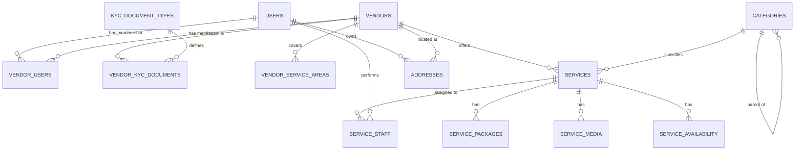
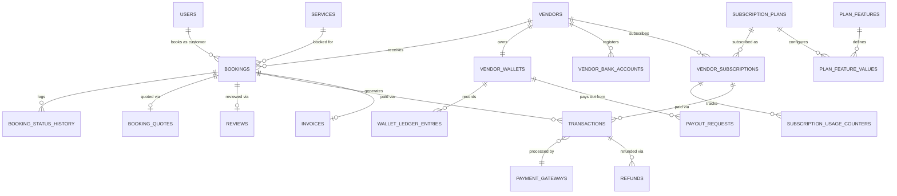

# Database Schema

Conventions used throughout: every table has `id BIGINT UNSIGNED PK`, `created_at`, `updated_at` unless noted. `deleted_at` = soft-deletes enabled. Money columns are `BIGINT` minor units (cents/fils), never `DECIMAL`/`FLOAT`, paired with a `currency_code CHAR(3)`. All `*_id` foreign keys are indexed; composite indexes are called out where they matter for query patterns (vendor dashboards, availability lookups).

## 1. Identity & Access

**users**
| Column | Type | Notes |
|---|---|---|
| name, email (unique), phone (unique, nullable) | string | |
| email_verified_at, phone_verified_at | timestamp nullable | |
| password | string | hashed |
| user_type | enum(admin, vendor, customer) | fast discriminator; fine-grained access via Spatie roles |
| avatar_path | string nullable | |
| locale, timezone | string | defaults from platform settings |
| status | enum(active, suspended, banned) | |
| last_login_at | timestamp nullable | |
| two_factor_secret, two_factor_recovery_codes, two_factor_confirmed_at | text/timestamp nullable | Fortify-compatible 2FA |
| deleted_at | soft delete | |

**roles / permissions / model_has_roles / model_has_permissions / role_has_permissions** — standard Spatie `laravel-permission` tables, unmodified.

**personal_access_tokens** — standard Sanctum table.

**device_sessions**
| Column | Type | Notes |
|---|---|---|
| user_id | FK users | |
| device_name, device_type, ip_address, user_agent | string | |
| last_active_at | timestamp | |
| revoked_at | timestamp nullable | user can revoke remotely |

**otp_codes**
| Column | Type | Notes |
|---|---|---|
| user_id | FK users nullable | nullable to support pre-registration phone/email checks |
| channel | enum(email, sms) | |
| purpose | enum(email_verification, phone_verification, password_reset, login_2fa) | |
| code_hash | string | never store plaintext OTP |
| expires_at, consumed_at | timestamp nullable | |
| attempts | unsignedTinyInt | rate-limit brute force |

**activity_logs** — `spatie/laravel-activitylog`-compatible: `log_name, description, subject_type, subject_id, causer_type, causer_id, properties (json)`.

## 2. Vendor Management

**vendors**
| Column | Type | Notes |
|---|---|---|
| user_id | FK users | the owner |
| business_name, slug (unique) | string | |
| description | text nullable | |
| logo_path, cover_path | string nullable | |
| email, phone, whatsapp | string nullable | public contact, distinct from owner's login email |
| address_id | FK addresses nullable | |
| status | enum(pending, approved, rejected, suspended) | |
| rejection_reason | text nullable | |
| approved_at, approved_by | timestamp / FK users nullable | |
| commission_override | decimal nullable | overrides `commission_rules` platform default for this vendor |
| currency_code, timezone | string | |
| deleted_at | soft delete | |

**kyc_document_types** — admin-managed catalog: `name, is_required, applicable_country_code nullable, instructions`.

**vendor_kyc_documents**
| Column | Type | Notes |
|---|---|---|
| vendor_id | FK vendors | |
| kyc_document_type_id | FK kyc_document_types | |
| file_path | string | |
| status | enum(pending, approved, rejected) | |
| rejected_reason | text nullable | |
| reviewed_by, reviewed_at | FK users / timestamp nullable | |

**vendor_users** (pivot — vendor owner + vendor staff)
| Column | Type | Notes |
|---|---|---|
| vendor_id | FK vendors | |
| user_id | FK users | |
| role | enum(owner, manager, staff) | |
| permissions | json nullable | optional per-member override on top of role |
| invited_by | FK users nullable | |
| joined_at | timestamp | |

**vendor_service_areas**
| Column | Type | Notes |
|---|---|---|
| vendor_id | FK vendors | |
| type | enum(radius, polygon) | |
| center_lat, center_lng, radius_km | decimal nullable | for `radius` type |
| polygon | json nullable | GeoJSON, for `polygon` type |
| city, country_code | string | |

## 3. Service Catalog

**categories** (self-referencing tree)
| Column | Type | Notes |
|---|---|---|
| parent_id | FK categories nullable | |
| name, slug (unique) | string | |
| icon_path, image_path | string nullable | |
| description | text nullable | |
| attribute_schema | json | admin-defined field schema (name, type, required, options) validated against `services.attributes` — **this is the mechanism that makes the platform vertical-agnostic** |
| booking_mode_allowed | json | array subset of `[slot, request]` |
| sort_order, is_active | | |
| seo_meta | json nullable | title, description, og image |

**services**
| Column | Type | Notes |
|---|---|---|
| vendor_id | FK vendors | |
| category_id | FK categories | |
| title, slug | string | |
| short_description, description | text nullable | |
| base_price | bigint (minor units) | |
| price_type | enum(fixed, hourly, quote) | `quote` forces `booking_mode = request` |
| duration_minutes | int nullable | null when `price_type = quote` |
| attributes | json | validated against `category.attribute_schema` |
| status | enum(draft, active, paused, rejected) | |
| is_featured, featured_until | boolean / timestamp nullable | gated by subscription plan feature |
| avg_rating, review_count, view_count | computed/cached | denormalized for list performance |
| deleted_at | soft delete | |

Indexes: `(vendor_id, status)`, `(category_id, status)`, spatial/geo index via joined `addresses`/`vendor_service_areas` for location search.

**service_packages** — variants/tiers: `service_id, name, price, duration_minutes, description, sort_order`.

**service_media** — `service_id, type enum(image,video), path, sort_order`.

**service_availability**
| Column | Type | Notes |
|---|---|---|
| service_id | FK services | |
| staff_id | FK users nullable | null = any staff |
| day_of_week | tinyint nullable | for recurring weekly rules |
| specific_date | date nullable | for one-off overrides/holidays |
| start_time, end_time | time | |
| is_recurring | boolean | |

**service_staff** (pivot) — `service_id, staff_user_id` — which vendor staff can perform a service.

## 4. Booking & Scheduling

**bookings**
| Column | Type | Notes |
|---|---|---|
| booking_number | string unique | human-readable reference |
| customer_id | FK users | |
| vendor_id | FK vendors | |
| service_id | FK services | |
| service_package_id | FK service_packages nullable | |
| staff_id | FK users nullable | assigned vendor staff |
| booking_mode | enum(slot, request) | mirrors `services.price_type` |
| scheduled_at | timestamp nullable | null until a request-mode quote is accepted |
| duration_minutes | int | |
| address_id | FK addresses nullable | for at-customer-location services |
| status | enum(pending, quoted, confirmed, in_progress, completed, cancelled, disputed, refunded) | |
| price, currency_code | bigint / char(3) | |
| cancellation_reason, cancelled_by, cancelled_at | | |
| rescheduled_from_id | FK bookings nullable, self-ref | audit trail of reschedules |
| notes | text nullable | |
| deleted_at | soft delete | |

Indexes: `(vendor_id, scheduled_at)`, `(customer_id, status)`, `(staff_id, scheduled_at)` for availability clash checks.

**booking_status_history** — `booking_id, from_status, to_status, changed_by, note, created_at` — full audit trail (also feeds dispute resolution).

**booking_quotes** (request-mode only) — `booking_id, vendor_id, quoted_price, quoted_duration, message, status enum(pending,accepted,rejected,expired), expires_at`.

**booking_cancellation_policies** — `vendor_id nullable (null = platform default), category_id nullable, window_hours, refund_percentage`.

## 5. Payments & Transactions

**payment_gateways** — admin-managed, adapter-resolved by `driver`: `driver enum(stripe,paypal,offline,bank_transfer,cash), name, is_active, is_default, config json (encrypted), sort_order`.

**transactions**
| Column | Type | Notes |
|---|---|---|
| transaction_number | string unique | |
| payable_type, payable_id | polymorphic | `Booking` or `VendorSubscription` |
| user_id | FK users | payer |
| vendor_id | FK vendors nullable | |
| payment_gateway_id | FK payment_gateways | |
| type | enum(payment, refund, payout) | |
| amount, currency_code, fx_rate | | fx_rate vs platform base currency, snapshotted |
| status | enum(pending, processing, success, failed, refunded) | |
| gateway_reference | string nullable | provider's transaction id |
| meta | json nullable | raw gateway payload for reconciliation |

**invoices** — `invoice_number, invoiceable_type/id (Booking|VendorSubscription), billed_to_user_id, amount, tax_amount, discount_amount, total, currency_code, status enum(draft,issued,paid,void), pdf_path, issued_at, due_at`.

**refunds** — `transaction_id, amount, reason, status, processed_by, processed_at`.

## 6. Vendor Wallet & Payouts

**vendor_wallets** — `vendor_id (unique), balance, currency_code`.

**wallet_ledger_entries** — `wallet_id, type enum(credit,debit), amount, balance_after, reference_type/id (polymorphic: Booking, PayoutRequest, Refund), description` — append-only ledger, `balance` on wallet is a cached projection.

**commission_rules** — `scope enum(platform,category,vendor,plan), scope_id nullable, type enum(percentage,flat), value, min_amount nullable, max_amount nullable, is_active` — resolved most-specific-wins (vendor > plan > category > platform).

**payout_requests** — `vendor_id, wallet_id, amount, method enum(bank_transfer,other), vendor_bank_account_id nullable, status enum(pending,approved,processing,paid,rejected), requested_at, processed_by, processed_at, rejection_reason`.

**vendor_bank_accounts** — `vendor_id, account_holder_name, account_number (encrypted cast), bank_name, iban_or_routing, is_default`.

## 7. Subscription & Billing

**subscription_plans** — `name, slug, description, price, billing_cycle enum(monthly,yearly,lifetime), trial_days, is_active, is_default, sort_order`.

**plan_features** — admin-defined capability catalog, e.g. rows for `max_services`, `max_images_per_service`, `max_staff`, `max_bookings_per_month`, `storage_limit_mb`, `chat_enabled`, `reports_enabled`, `analytics_enabled`, `priority_listing`, `featured_listing_count`: `key (unique), label, type enum(limit,boolean), description`.

**plan_feature_values** — `plan_id, plan_feature_id, value json (number|boolean)` — the actual limit/flag per plan; this pairing is what "add a plan with no code changes" means in practice.

**vendor_subscriptions** — `vendor_id, subscription_plan_id, status enum(trialing,active,past_due,cancelled,expired), starts_at, ends_at, trial_ends_at, cancelled_at, auto_renew`.

**subscription_usage_counters** — `vendor_subscription_id, feature_key, current_value, period_start, period_end` — tracks consumption against `plan_feature_values` limits (e.g. bookings this month); reset by scheduler on period rollover.

## 8. Reviews & Ratings

**reviews** — `booking_id (unique — one review per booking), customer_id, vendor_id, service_id, rating tinyint(1-5), title, comment, vendor_reply nullable, vendor_replied_at, status enum(published,hidden,flagged), deleted_at`.

## 9. Notifications

**notification_templates** — `key, channel enum(email,sms,push,in_app), subject, body (placeholders), locale, is_active` — admin-editable copy, no hardcoded strings in mailables.

**notifications** — Laravel's default polymorphic notifications table.

**notification_preferences** — `user_id, channel, event_key, is_enabled`.

## 10. Messaging

**conversations** — `booking_id nullable, vendor_id, customer_id, last_message_at`.

**messages** — `conversation_id, sender_id, body nullable, attachment_path nullable, read_at nullable`.

## 11. Search & Discovery

**search_logs** — `user_id nullable, query, filters json, results_count` — no dedicated "search" tables beyond this; discovery is a query layer over `services`/`categories`/`vendor_service_areas`. Logs feed future recommendation/AI work.

## 12. Location & Maps

**addresses** — `addressable_type/id (polymorphic: User, Vendor, Booking), label, line1, line2, city, state, country_code, postal_code, lat, lng, is_default`.

Map provider itself has no table — it's a `settings` row (`group = 'map'`) resolved by a `MapProviderManager` (Leaflet/OSM+Nominatim default, Google Maps optional driver).

## 13. Platform Settings & CMS

**settings** — generic admin-editable config store: `group (general, map, mail, payment, seo, booking), key, value json, is_public boolean` — unique on `(group, key)`.

**cms_pages** — `slug, title, content json (block-based) or html, locale, is_published`.

**legal_documents** — `type enum(terms,privacy,vendor_agreement), version, content, published_at` — versioned so vendors/customers can be shown "terms changed" prompts.

## 14. Localization

**languages** — `code, name, native_name, is_active, is_default, direction enum(ltr,rtl)`.

**translations** — `locale, group, key, value` (or backed by a package like `spatie/laravel-translatable` on translatable columns instead — decide at implementation time per content type).

**currencies** — `code, symbol, decimal_places, is_active, is_default, exchange_rate_to_base, updated_at`.

**tax_rules** — `name, country_code, rate_percentage, applies_to enum(services,subscriptions,all), is_active`.

## 15. Reporting & Analytics

**report_exports** — `user_id, type, filters json, file_path nullable, status enum(pending,processing,ready,failed)` — heavy exports run as queued jobs, not synchronously.

## 16. Media/Storage

**media** — Spatie Media Library-compatible: `model_type, model_id, collection_name, disk, file_name, mime_type, size, path`.

---

## ER Diagram — Identity, Vendor & Catalog

## ER Diagram — Booking, Payments, Wallet & Subscription

## Commission resolution order

`commission_rules` can target `platform` (one row, always exists as fallback), `category`, `vendor`, or `plan`. At transaction time, resolve in this precedence: **vendor-specific override → plan-level rule → category-level rule → platform default**. Implemented as a single `CommissionResolver::resolve($booking)` service, never inlined at call sites.
