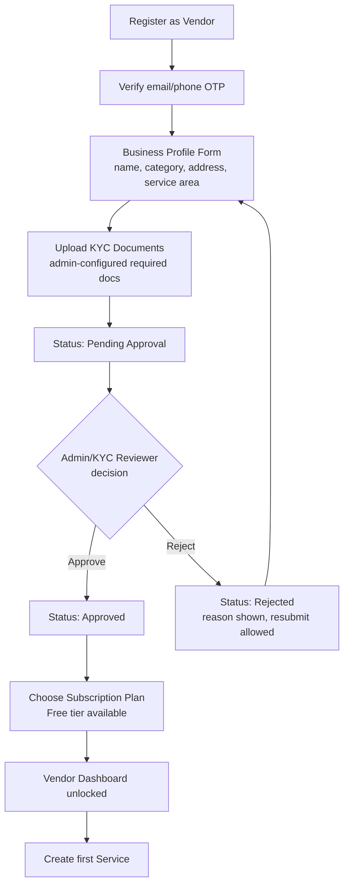
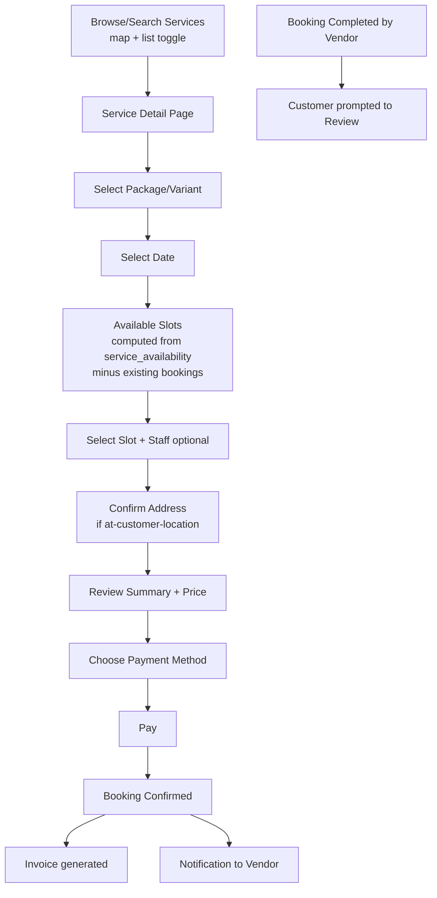
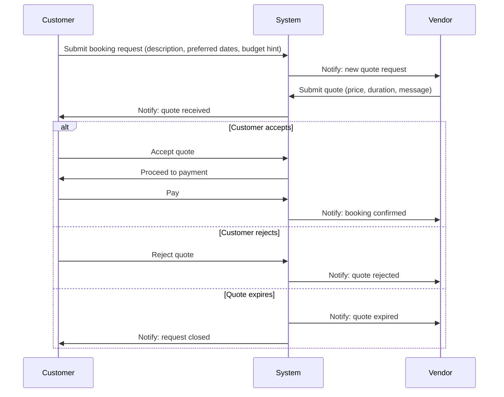
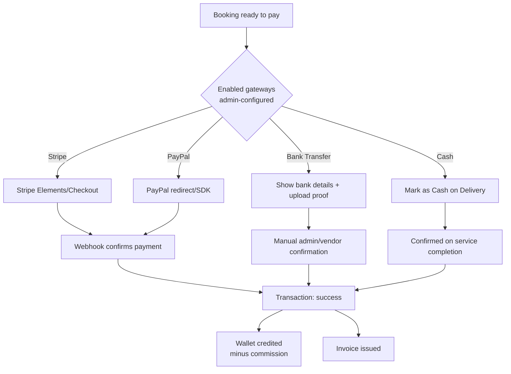

# Core UI/UX Flows

Design language: large spacing, rounded corners, minimal chrome, dark mode parity, skeleton loaders on every list/detail view, explicit empty and error states on every screen that fetches data (never a bare blank screen). Reference points: Stripe/Linear (admin density + clarity), Airbnb/Urban Company (discovery + booking warmth), Fiverr (vendor storefront).

## 1. Vendor onboarding & approval



UX notes: the pending-approval screen shows a progress tracker (Profile ✓ → KYC ✓ → Review → Approved), not a dead-end "please wait." Rejection always carries a specific, admin-written reason field, never a generic "denied."

## 2. Customer booking — slot-based service (e.g. salon, tutor)



Edge state: if the selected slot is taken between page-load and submit (race condition), the API returns `409` and the UI re-fetches availability inline rather than showing a dead error page — see [validation & edge cases](06-validation-and-edge-cases.md#booking-slot-race).

## 3. Customer booking — request/quote-based service (e.g. construction, consultant)



## 4. Payment flow (gateway-agnostic)



## 5. Admin dashboard information architecture

```
Admin Shell (persistent sidebar, top bar with global search + notifications)
├── Overview (KPI cards: GMV, active vendors, bookings today, pending approvals)
├── Vendors (list → detail tabs: Profile | KYC | Services | Bookings | Financials)
├── Catalog (Categories tree editor with attribute-schema builder)
├── Bookings (all-bookings table, dispute queue)
├── Payments (transactions, refunds, payout approval queue, gateway config)
├── Subscriptions (plans + feature matrix editor, vendor subscription list)
├── Reviews (moderation queue)
├── Reports (revenue, vendor performance, exports)
├── Settings (general, map provider, mail, tax, languages/currencies, legal, notification templates)
├── Staff & Roles
└── Activity Log
```

## 6. Vendor dashboard information architecture

```
Vendor Shell (own-scope only, plan-usage banner if near a limit)
├── Overview (bookings today, revenue this month, rating, plan usage bars)
├── Services (list, create/edit with attribute form generated from category schema)
├── Bookings (calendar view for slot-based, kanban/queue for request-based quotes)
├── Wallet (balance, ledger, request payout)
├── Reviews (view + reply)
├── Staff (invite/manage vendor staff, if plan allows)
├── Messages (if plan allows chat)
└── Subscription (current plan, usage, upgrade)
```

## 7. Empty/error/loading state rules (applies to every screen above)

- **Loading:** skeleton matching the eventual layout (never a spinner-only screen for list/detail views).
- **Empty:** an illustration/icon + one-sentence explanation + a primary action (e.g. "No services yet — Create your first service").
- **Error:** what happened in plain language + a retry action; validation errors surface inline on the specific field, never only as a toast.
